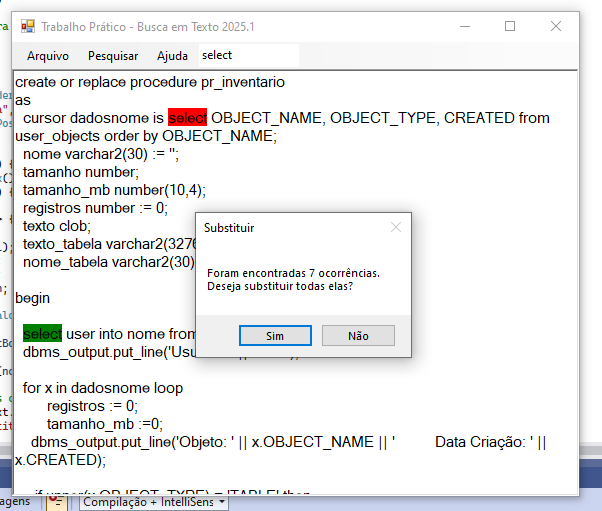

# 📘 Busca em Texto – Projeto AEDS II (2025/1)

Este projeto implementa uma ferramenta de busca textual utilizando quatro algoritmos clássicos de pesquisa, integrados à interface gráfica disponibilizada pelo professor para o semestre **2025/1**.

O sistema permite carregar textos, pesquisar padrões, destacar ocorrências e substituir automaticamente cada achado.

---

## 👨‍💻 Autor

**Lucas Henrique Albergaria**  
Faculdade COTEMIG  
Algoritmos e Estruturas de Dados II – 2025/1  
Professor: **Virgílio Borges de Oliveira**

---

## 🧩 Funcionalidades

### 🔍 Algoritmos de busca implementados

O editor utiliza quatro métodos de pesquisa:

- **Força Bruta**
- **Rabin-Karp**
- **KMP (Knuth–Morris–Pratt)**
- **Boyer–Moore**

Os algoritmos foram fornecidos pelo professor.  
➡️ *Minha contribuição:* adicionei a lógica para encontrar **todas as ocorrências** via substrings sem alterar o núcleo dos algoritmos originais.

---

## 🖥️ Interface (Form1.cs)

O arquivo **Form1.cs** foi totalmente desenvolvido por mim, integrando:

### 🗂 Menu Arquivo
- **Novo** – limpa o editor  
- **Abrir** – aceita arquivos `.txt` (UTF-8) e `.rtf`  
- **Sair** – encerra o programa  

### 🔎 Menu Pesquisar
Para cada algoritmo:
- Remove destaques anteriores  
- Realiza a busca  
- Destaca cada ocorrência com cores diferentes  
- Pergunta se deseja substituir  
- Permite inserir a nova palavra  

### ℹ Menu Ajuda
- **Sobre** – mostra informações do autor do trabalho

---

## 🎨 Destaque de ocorrências

Cada ocorrência é destacada com uma cor diferente, alternando entre:

- Vermelho  
- Verde  
- Azul  
- Laranja  
- Roxo  
- Ciano  
- Marrom  
- Magenta  

Isso facilita visualizar todas as posições onde o padrão ocorre.

---

## 🔁 Substituição de texto

Após a busca, o sistema pergunta:

> “Deseja substituir todas as ocorrências?”

Se o usuário confirmar:
1. Uma janela surge pedindo a nova palavra  
2. Todas as ocorrências encontradas são substituídas no editor  

---

## 📂 Interface do Projeto

